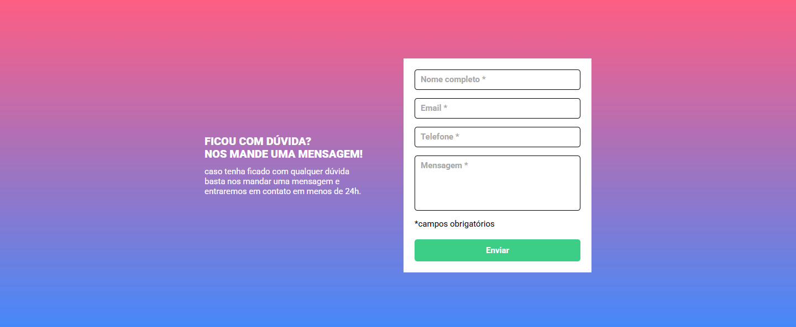

# DevQuest - Form with JavaScript validation

## Languages
This first section is in English. 

[Versão em português logo abaixo.](#portuguese)

## Context

This is a solution to the HTML + CSS + intermediate JavaScript challenge from the [DevQuest course](https://evento.devemdobro.com/matriculas-abertas).

> - Form validation must be done with pure javascript.
>
> - When clicking to submit the form, if any field is not filled in, the input border should turn red and a "required field" message should appear below the field that was not filled in, as per Figma.
>
> - The form background should be made using the image attached to the lesson.

## Table of contents

- [Overview](#overview)
  - [Screenshot](#screenshot)
  - [Links](#links)
- [My process](#my-process)
  - [Built with](#built-with)
  - [What I learned](#what-i-learned)
- [Author](#author)

## Overview

### Screenshot

#### Desktop

<p align="center">
  
</p>

#### Mobile

<p align="center">
  
</p>

### Links

- Solution URL: [GitHub Repository](https://github.com/xuaun/html-form-JavaScript-validation)
- Live Site URL: [Live Page](https://your-live-site-url.com)

## My process

### Built with

- Semantic HTML5 markup
- CSS custom properties
- Flexbox
- Media Query
- JavaScript

### What I learned

In this project I was able to use flexbox, variable, and media query concepts in CSS, as well as using a ready-made Figma design to create this component. I also used `rem` for measurements.

```js
formulario.addEventListener("submit", (event) => {
  if (!verificarCampos()) {
    event.preventDefault();
  }
});

function verificarCampos() {
  if (campoNome.value == "") {
    campoNome.classList.add("campo-invalido");
    campoInvalidoTexto[0].classList.add("visivel");
  }

  // Some more code
}
```

## Author

- Website - [João Víctor de Araujo Lima's Portfolio](https://xuaun.github.io/)
- Frontend Mentor - [@xuaun](https://www.frontendmentor.io/profile/xuaun)


____
<br>

# <p id="portuguese"> DevQuest - Formulário com validação por JavaScript</p>

## Contexto

Esta é uma solução para o desafio de HTML + CSS + JavaScript intermediário do [curso DevQuest](https://evento.devemdobro.com/matriculas-abertas).

> - A validação do formulário deve ser feita com javascript puro.
>
> - Ao clicar para enviar o formulário, se caso algum campo não estiver preenchido, a borda do input deve ficar vermelha e uma mensagem de "campo obrigatório" deve aparecer embaixo do campo que não foi preenchido, conforme o figma.
>
> - O fundo do formulário deve ser feito usando a imagem em anexo na aula.

## Lista de conteúdos

- [Visão Geral](#visão-geral)
  - [Prints](#prints)
  - [Links](#links-pt)
- [Meu processo](#meu-processo)
  - [Tecnologias utilizadas](#tecnologias-utilizadas)
  - [O que eu aprendi](#o-que-eu-aprendi)
- [Autor](#autor)

## Visão Geral

### Prints

#### Computador

<p align="center">
  
</p>

#### Celular

<p align="center">
  
</p>

### <p id="links-pt">Links</p>

- Link da solução: [Repositório no GitHub](https://github.com/xuaun/html-form-JavaScript-validation)
- Site com a solução: [Página do projeto no ar](https://your-live-site-url.com)

## Meu processo

### Tecnologias utilizadas

- HTML5
- CSS
- Flexbox
- Media Query
- JavaScript

### O que eu aprendi

Neste projeto eu pude utilizar conceitos de flexbox, de variáveis e de media query no CSS, além de usar um design pronto do Figma para a elaboração deste componente. Eu também usei `rem` para as medidas.

```js
formulario.addEventListener("submit", (event) => {
  if (!verificarCampos()) {
    event.preventDefault();
  }
});

function verificarCampos() {
  if (campoNome.value == "") {
    campoNome.classList.add("campo-invalido");
    campoInvalidoTexto[0].classList.add("visivel");
  }

  // Mais código
}
```

## Autor

- Website - [Portfólio - João Víctor de Araujo Lima](https://xuaun.github.io/)
- Frontend Mentor - [@xuaun](https://www.frontendmentor.io/profile/xuaun)
